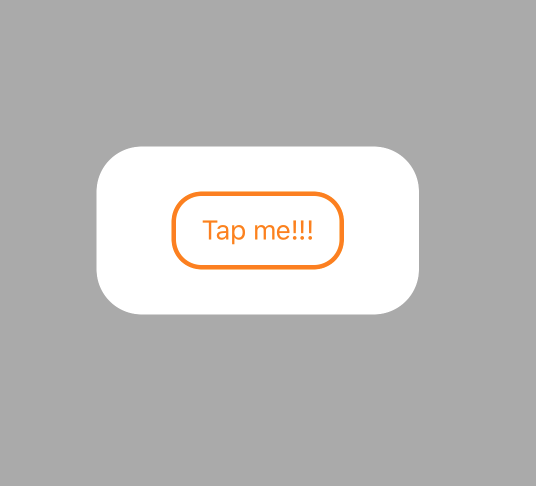

#GNLayout#
version 0.1

##TODO:
- Add identifier to LayoutEntry
- Add a dictionary for LayoutEntry
- Add STATE feature
	- Show/Hide state is must a minimum
	- Animate between states	
	- Custom states
	 	

#Basic elements of this kit

##Current display elements

	class View: GNLayoutDisplayEntry
	class Button: GNLayoutDisplayEntry
	class Label: GNLayoutDisplayEntry

####Create your own entry:

Every single class is inherited from **GNLayoutDisplayEntry** class.
See more about **GNLayoutDisplayEntry** class. 

##Easy configuration
	
Every display entry has a property and a layout configuration, those configurations are the following:

###Property configuration

	properties: [
	    .fill(.lightGray),
	    .cornerRadius(10)
	]
	
All element is valid from **GNLayoutDisplayProperty**, but there are some control specific option, like imageEdgeInsets for a Button component. These properties are also animateable.
	
	enum GNLayoutDisplayProperty {
	    // View specific
	    case cornerRadius(_ :CGFloat)
	    case fill(_ :UIColor)
	    case border(_ :UIColor,_ :CGFloat)
	    
	    // Control specific
	    case textColor(_ :UIColor)
	    case contentEdgeInsets(_ :UIEdgeInsets)

	    // Button specific
	    case titleEdgeInsets(_ :UIEdgeInsets)
	    case imageEdgeInsets(_ :UIEdgeInsets)
	}

See more about **GNLayoutDisplayProperty** class.

##Layout configuration
	layout: [
	    .horizontal(5),
	    .bottom(5),
	    .top(27) // +22 status bar
	]
	
All element is must be valid for a **GNLayoutCompositionEntry**., there are no exception, because a Layout Display Entry is basically a UIView based model.
	
	enum GNLayoutCompositionEntry {
		// Center
	    case center
	    case centerX
	    case centerY
	    
		// TLBR
	    case fill(_ :CGFloat)
	    case horizontal(_ :CGFloat)
	    case vertical(_ :CGFloat)
	    case top(_ :CGFloat)
	    case right(_ :CGFloat)
	    case left(_ :CGFloat)
	    case bottom(_ :CGFloat)
	
		// Vertical relations
	    case before(_:UIView, _ :CGFloat)
	    case after(_:UIView,_ :CGFloat)
	
		// Size
	    case size(_ :CGFloat, _ :CGFloat)
	    case width(_ :CGFloat)
	    case height(_ :CGFloat)
	}

See more about **GNLayoutCompositionEntry** class.

##Subviews
Nested views are works perfectly in that way.

**There is an easy example for a box in a button.**

	
Example code:
	
    subviews: [
        View(
             properties: [
                .fill(.white),
                .cornerRadius(30)
            ],
             layout: [
                .center
            ],
             subviews: [
                Button(
                    "Tap me!!!",
                    properties: [
                        .fill(.white),
                        .border(.orange,3),
                        .textColor(.orange),
                        .cornerRadius(20),
                        .contentEdgeInsets(UIEdgeInsets(top: 15, left: 20, bottom: 15, right: 20))
                    ],
                    attributes: [
                        .horizontal(50),
                        .vertical(30)
                    ]
                )
            ]
        )
    ]
